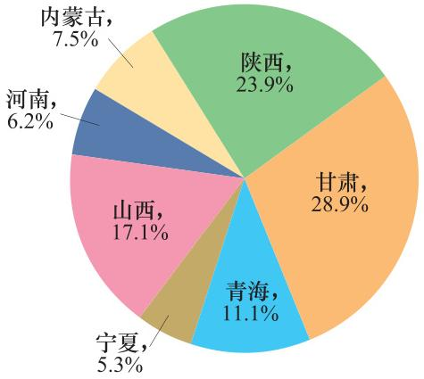

54.3% ；长度在 1000m及以上的侵蚀沟道数量14.70万条，占总数的 22.0% ,面积8.56万 $ km^{2} $ ，占总面积的 45.7% 。西北黄土高原区侵蚀沟道数量、长度与面积见表6-3-2。

表 6-3-2西北黄土高原区侵蚀沟道数量、长度与面积

<table>
<thead>
<tr>
 <th rowspan="2">侵蚀沟道级别①</th>
 <th colspan="3">沟道数量/万条</th>
 <th colspan="3">沟道长度/万km</th>
 <th colspan="3">沟道面积/万km2</th>
</tr>
<tr>
 <th>丘陵沟壑区</th>
 <th>高原沟壑区</th>
 <th>合计</th>
 <th>丘陵沟壑区</th>
 <th>高原沟壑区</th>
 <th>合计</th>
 <th>丘陵沟壑区</th>
 <th>高原沟壑区</th>
 <th>合计</th>
</tr>
</thead>
<tbody>
<tr>
 <td>合计</td>
 <td>55.64</td>
 <td>11.03</td>
 <td>66.67</td>
 <td>47.1</td>
 <td>9.23</td>
 <td>56.33</td>
 <td>15.67</td>
 <td>3.05</td>
 <td>18.72</td>
</tr>
<tr>
 <td>500（含）～1000m</td>
 <td>43.31</td>
 <td>8.66</td>
 <td>51.97</td>
 <td>29.76</td>
 <td>5.97</td>
 <td>35.73</td>
 <td>8.43</td>
 <td>1.73</td>
 <td>10.16</td>
</tr>
<tr>
 <td>1000m及以上</td>
 <td>12.33</td>
 <td>2.37</td>
 <td>14.70</td>
 <td>17.34</td>
 <td>3.26</td>
 <td>20.60</td>
 <td>7.24</td>
 <td>1.32</td>
 <td>8.56</td>
</tr>
</tbody>
</table>

$ \textcircled{1} $侵蚀沟道级别用侵蚀沟道的长度表示。

在西北黄土高原区中，甘肃省侵蚀沟道数量最多，占区域侵蚀沟道总数量的 40.3% ；其次为陕西省，占 21.1% ：侵蚀沟道数量最少的为宁夏回族自治区，占 2.51% 。侵蚀沟道面积与数量基本一致，甘肃省和陕西省面积较大，占区域侵蚀沟道总面积的比例分别达到 28.9%和 23.9% ：宁夏回族自治区、河南省及内蒙古自治区侵蚀沟道面积较小，分别占 5.3%、6.2%、7.5% 。西北黄土高原区各省（自治区）侵蚀沟道数量与面积见附表A32，各省（自治区）侵蚀沟道面积占全区沟道面积比例见图 6-3-1。

图 6-3-1西北黄土高原区各省（自治区）侵蚀沟道面积占全区沟道面积比例

按西北黄土高原区侵蚀类型统计，高原沟壑区侵蚀沟道共11.03万条，沟道面积3.05万 $ km^{2} $ ；丘陵沟壑区侵蚀沟道共 55.64万条，沟道面积15.67万 $ km^{2} $ 。高原沟壑区侵蚀沟道数量占侵蚀沟道总数的 16.5% ，丘陵沟壑区占 83.5%。

高原沟壑区侵蚀沟道主要分布于甘肃省东部、陕西省延安南部和渭河以北、山西省南部等地区，平均沟道纵比为 20.42% ，沟道沟壑密度1.25km/ $ km^{2} $ 。丘陵沟壑区依据地形地貌差异分为5个副区。其中，第一、第二副区主要分布于陕西省北部、山西省西北部和内蒙古自治区南部，平均沟道纵比分别为 19.93%、14.06% ，沟壑密度分别为3.4～7.6km/ $ km^{2} $ 、3.0~ 5.0km/ $ km^{2} $ ；第三、第四副区主要分布于青海省东部、甘肃省中部、河南省西部，平均沟道纵

