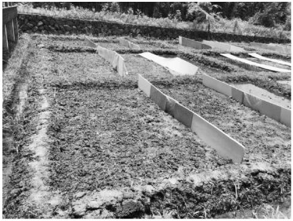
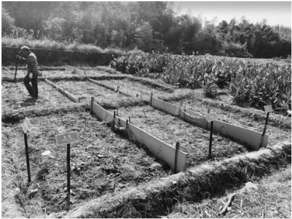

(a）初始状态

（b）最终状态

图 3    水松生长情况对比

# 3.3.2  美人蕉植株高度和开花情况

美人焦植株高度及开花数见表7。实验发现美人焦最终高度不施肥组 <施苗木种植基质组 <施花木专用基质组，3组重复平均分别为 90.7～119.3 cm 、 118.7～150.3 cm， 112.7~163 cm ，可见苗木种植基质与花木专用基质的肥力较为显著，能明显促进美人蕉的生长。但从整体性来说，使用苗木种植基质组的美人蕉长势更为均匀，高度范围相差最小。这可能是由于施用的基质肥力越高，植株间的竞争越强，长势越好的植株越容易吸收土壤中的基质，使其生长更为旺盛，从而拉开植株间的差距。美人蕉开花数比较如图4所示，生长情况对比如图5所示。

表 7美人蕉植株高度及开花数

<table>
<thead>
<tr>
 <th colspan="2" rowspan="2"></th>
 <th colspan="3">美人蕉</th>
</tr>
<tr>
 <th>不施肥</th>
 <th>施苗木种植基质</th>
 <th>施花木专用基质</th>
</tr>
</thead>
<tbody>
<tr>
 <td rowspan="4">高度/cm</td>
 <td>第一组</td>
 <td>105~126</td>
 <td>120~146</td>
 <td>112～160</td>
</tr>
<tr>
 <td>第二组</td>
 <td>62~101</td>
 <td>112~150</td>
 <td>116~167</td>
</tr>
<tr>
 <td>第三组</td>
 <td>105~131</td>
 <td>124~155</td>
 <td>110~162</td>
</tr>
<tr>
 <td>平均</td>
 <td>90.7~119.3</td>
 <td>118.7~150.3</td>
 <td>112.7~163</td>
</tr>
<tr>
 <td rowspan="4">开花数/（朵/株)</td>
 <td>第一组</td>
 <td>19</td>
 <td>20</td>
 <td>23 </td>
</tr>
<tr>
 <td>第二组</td>
 <td>19</td>
 <td>23</td>
 <td>26</td>
</tr>
<tr>
 <td>第三组</td>
 <td>17</td>
 <td>23</td>
 <td>27</td>
</tr>
<tr>
 <td>平均</td>
 <td>18</td>
 <td>22</td>
 <td>25</td>
</tr>
</tbody>
</table>

经测量发现美人蕉最终开花数不施肥组 <施苗木种植基质组 <施花木专用基质组，3组重复平均分别为18朵/株、22朵/株、25朵/株，可见苗木种植基质与花木专用基质都能提高美人蕉的开花数，尤其是施用花术专用基质，能使美人蕉充分展示作为园林植物的花卉观赏价值。

