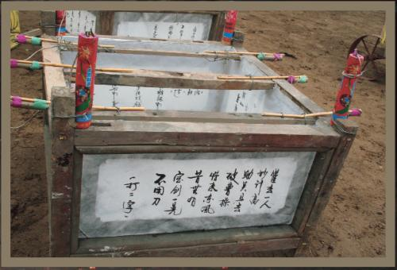

# 傩与社火

场子设在村边低洼处一块地里，四面土坡都是看台。几张桌子一字排开当主席台，手动探照灯（一位老乡专门负责的一只大灯）一打，高音喇叭响起来：“喂，老乡们，咱村的老虎火开始啦，没吃完饭的快点，抓紧点啦！”一阵催促，一番叮咛，乡音乡味乡亲，土得掉渣，香得可心。

终于开始了，一阵激情四射的起火当头，欢声雷动。高音喇叭里主持人老乡不紧不慢地介绍，场子里壮汉们步调一致地装火，点火，放！一拨又一拨冲天而起的烟火，变换着色彩、姿态和声响，沸腾了宁静的夜空。从没见过这样的烟火阵势，真真五花八门，匪夷所思。各种火仿佛长着眼晴长着腿，机灵诡谲，一 会儿这样弯曲，一会儿那样缠绕，一会儿一条横线，一会儿遍地开花。你听听名字吧，什么张飞蹬鼓，火烧战船，金盏玉台盘，拖白莲，星星草，伞火，老虎火，葡萄火，锅子火，老杆火，七节火，起火，平火，喷花，宫花······据说光锅子火火谱上就有90多种。最感人是伞火，最壮观是老虎火，最气势磅礴是老杆火。

这个绑着火种的木架子，四面都有谜语，这一笔娟秀的行书，不知是出自谁人之手。

