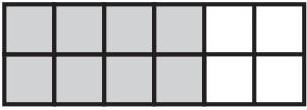

# ISAT Practice Cumulative, Chapters 1-9

# PART 1    Multiplc  Choice

Read each question. Then fill in the correct answer on the answer sheet provided by your teacher or on a sheet of paper.

1. Sancho picked up a handful of coins from a jar without looking.He got 7 pennies,5 nickels, 3 dimes, and 2 quarters.What fraction of the coins that he picked were nickels?
A $ \frac{2}{17} $ C $ \frac{5}{17} $
B $ \frac{3}{17} $ D $ \frac{7}{17} $

2. Paige cut a cake into 20 pieces. If 14 pieces have been eaten, what fraction of the cake remains?
F $ \frac{1}{10} $ H $ \frac{3}{10} $
G $ \frac{1}{5} $ J $ \frac{2}{5} $

3. Natalie has washed the dishes 8 out of the last 12 nights.Which fraction shows the portion of time spent washing dishes?

A $ \frac{1}{3} $ C $ \frac{2}{3} $
B $ \frac{1}{2} $ D $ \frac{5}{6} $

4. Emilia used 4 of her 8 stamps to mail letters.Which fraction is less than $ \frac{4}{8} $
F $ \frac{5}{8} $ H $ \frac{1}{2} $
G $ \frac{3}{4} $ J $ \frac{3}{7} $

5. Which is a prime factor of the composite number 32?
A  2 c  4
B  3 D  5

6. The table shows the number of bills of each value that Bree received for her birthday.In all, what fraction of the number of bills that Bree received for her birthday were $10 or $20 bills?

<table>
<thead>
<tr>
 <th colspan="2">Birthday Money</th>
</tr>
</thead>
<tbody>
<tr>
 <td>Value of Bill</td>
 <td>Number of bills</td>
</tr>
<tr>
 <td>$5</td>
 <td>5</td>
</tr>
<tr>
 <td>$10</td>
 <td>3</td>
</tr>
<tr>
 <td>$20</td>
 <td>2</td>
</tr>
<tr>
 <td>$50</td>
 <td>1</td>
</tr>
</tbody>
</table>

F $ \frac{5}{22} $ H $ \frac{5}{11} $
G $ \frac{3}{11} $ J $ \frac{8}{11} $

7. Clarence bought a 3-pound can of mixed nuts for a party. One-fourth of the can is made up of walnuts, and two-fifths of the can is made up of peanuts. Which of the following shows the correct relationship between $ \frac{1}{4} $ and $ \frac{2}{5} $
A $ \frac{1} {4}=\frac{2} {5} $ C $ \frac{1} {4} <\frac{2} {5} $
B $ \frac{1} {4} > \frac{2} {5} $ D $ \frac{1} {5} < \frac{3} {1 0} $

