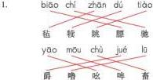
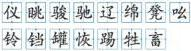

在四处张望着，嘴里不时地发出“咩咩”的叫声。而远处，悠闲的绵羊妈妈正在草原上散步呢！

# 基础练习卷2

# 一，生字复习

# 二、会用

\t2. (1)赞赏 (2)赞许 (3)赞同

3. $ \textcircled{1} $辽阔无垠 $ \textcircled{2} $膘肥体壮 $ \textcircled{3} $极目远眺

# 三、小练笔

4. 客案示例：星期天的早上，我和爸爸到附近的公园里散步。公园里绿树成荫，麻雀在技头飞来飞去，不时地发出清脆动听的叫声。花坛中五颜六色的月季花开得正艳，花瓣上的露水在阳光的照耀下亮晶晶的，像珍珠一样。湖边的空地上热闹极了，有的人在跑步，有的人在练健身操，还有的人伴着音乐在跳广场舞······多么美好而充满生机的夏日早晨啊！

# 金字塔

# 课内普查卷

# 一、识字与写字

1. 熠 (yi yu) 黏 (nian zhan) 湛 (shen zhan)

# 二、体会静态描写和动态描写的表达效果

2. 客案示例：九月的开罗，夕阳是金色的，田野、沙漠是金色的，连尼罗河的河水都泛着金光。远远望去，金字塔就像漂浮在金色的沙海中的金山。天上地下，一片耀眼的金色。因此说“九月的开罗是金色的”。

3. 答案示例： $ \textcircled{1} $胡夫金字塔的占地面积和体积都很庞大，在其建成几千年后，世界上才出现比它更高的建筑; $ \textcircled{2} $金字塔塔身的石块之间没有任何黏着物，却黏合得很紧密，锋利的刀刃都很难插入; $ \textcircled{3} $胡夫金字塔的地理位置和塔高的设计十分巧妙。

4. $ \textcircled{1}\textcircled{2}\textcircled{3}\textcircled{5}\textcircled{6} $

5.
胡夫金字塔（以下为答案示例）
地理位置：埃及首都开罗郊外的沙漠中。
外观：近似汉字“金”，气势雄伟。
功用：古埃及法老胡夫的陵墓。
特点：高、占地面积大、体积大、使用石料多、石块贴合紧密、设计巧妙。
评价：现存规模最大的金字塔，古埃及人民劳动和智慧的结晶。

6. 答案示例：第一篇材料中画横线的句子语言优美，把金字塔比作金山，既形象地写出了金字塔的形状，又体现出它的珍贵。第二篇材料中画横线的句子语言简洁，用具体的数字写出了建造金字塔的石头又多又重，整个金字塔又高又大的特点。将金字塔与我们熟悉的高楼、篮球场作比较，使我们理解起来更容易。

# 习作

# 中国的世界文化遗产

略。优秀例文参见《小学生绘本课堂·素材书》

# 第七单元测查卷

# 一、积累与运用

1. C

2. 		（1）棉绵锦
		（2）俊骏峻
		（3）眺挑跳

3. 		（1）澄（cheng）澄（deng）
		（2）哗（hua）哗（hua）

	4. 		（1）手忙脚乱
		（2）悠然自得
		（3）成群结队

\t5.(1)阳光下    翩翩起舞、随风飘动
(2)挤    运    没有响声    默默无言
(3)夕阳西下时石板小路旁的宁静    晚风吹过椴树顶时片片花瓣撒落到水面上的情景

