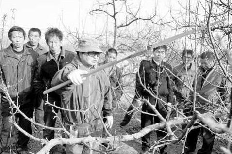

# 财政助农：福建茶农迎来又一春

本报记者  蔡茂楷

福建具有“茶之乡”、“茶之祖”等诸多美誉 2008年以来，为推进肥代茶产业，田统“五促进，两带动的目标，中央财政连续三年注入资金，总额适2.29亿元.整合省相关部门资全4.3亿元投人茶产业。中央和地方财政的扶持，有效控动了福建现代茶产业加速发展。

最近三年，可风说起一年一个新台阶，这个发展速度，主要得益于中央财政资金的杠杆效应。请起茶产业，福建省农业厅相关负责人林景元有着聊不尽的话题，“今年福建条产业再传好消息，全年茶园面积将达300万亩，居全国第四位，茶叶产量将超过27万吨，占全国茶叶总产量的五分之一居全国第一位。

在中央财政资叠的杠杆作用下，促进了福建茶园生态和茶叶品种更加优化：视进了茶叶质量提开和载民指：带动工推万支发资金和民间贸金投人现代茶业。如今，种茶，制茶，售茶，品茶斗茶，喜茶等已成为报建百姓重要生活元素

# 改善生态，构建现代茶产业发展基础

一条条宽教的机精路四通八达，装运有机肥的小四轮，穿梭其中：一条条畅通的水渠，蜿蜒纵横：一口口新建的蓄水池，星罗棋布......这是记者在松领县现代茶园见到的情景，自从2008年省里将松激县列人现代茶业生产建设项目县后，全县条叶生产基确设范就还渐变了模样，截至2010年上半年，松溪县完成项目总投资1953万元，建设标准化生态茶园526亩。

茶园的生奈环境和标准茶园建设是现代茶产业的关键环节。福建省大抓标准化生态茶园建设，制定了详细的补助标准，2008年-2010年，全省共建设标准化生态茶园29.39万亩，为福建茶叶的可持续健康发展真定了良好发展基础。

改善生态，更要改良品种。在具有”大陆阿里山”美誉的漳平市，早在199年，就有来自合湾商投县的谢东庆开辟了于亩优质高山答茶场。在现茶业项目资金的扶持下，漳平市大力改进茶树品种，着力提升境平水茶永福高山条和官田铁冠三大名优茶的品质和知名度。日前，中国茶叶学会已经审查通过，命名漳平市为”中国名茶之乡”。

在中央财政支持下，福建案出无性系良种大面积推广应用，现在，全名拥有国家级茶树自种 19个，省级良种21个，无性系良种推广面积达 95%，远高于全国 35%的平均水平，居全国领先地位。全省平均茶叶单产91公斤亩，高出全国 6、7个百分点，居全国第一。全省名优茶产量 9.53万吨，产值75亿元.分别占全省茶叶总产量和总产情的 35.3%,75%。

# 提升质量，奏响悦耳的茶农增收曲

记者来到全国最大乌龙茶主产区安溪县，在城区叶公园的生态茶园里.记者者到，每隔50就安麦工一合TFC型太阳能火虫器。工作人员手旭云介绍说，灭虫器收集取之不尽的太阳能作为能蒜，针对害虫生活习黄，诱条害虫。

自现代茶业项目在安离实施以来，该县通过建立璃虫害汇报点，配备TFC型太阳能灭虫系，虫情调报灯，双筒解剖镜，生物显微镜，机动赋雾器等设备提升茶叶质量安全。

汉位在安滨县.几乎在所有的获得中央购致支持的茶叶主产县，提升茶叶质量安全都列入了茶叶生产的重要指标。为抑制病虫害发生，减少农药施用，项目实南区域建立井不斯完善茶树病虫害测报点，形成相对完整的测抵体系，指导茶安科学防治病虫害，构建了一道茶叶质量安全保障网。

条叶质量安全的提升，促进了茶产业总体效日益辈开，农民收人尤其是茶区农民收人显者增加。2009年，指建全省农民人均收人为66802元，比2007年增加1213.1元，两年就增长 22.2%，安、福安，武夷山等茶叶主产县涉茶人口致占全县人口的 60%~70%，农民人均纯收入中的 50%~ 60%来自茶产业。

# 整合资金，带动优势特色茶产业发展

“现代茶业具资会补助改等起到了内两拨干斤”的作用，说及中央时改如可支持产业发展时，安客目务局量局未注设证为，要发展一个地区兼产业现代茶业实询的项目其实本来是必借的，但由于世有相美改黄的引我和版牌.很多如目实拍比慢，财政资金补助政策板大地年动了茶农，茶商.茶企参与的和最性。在安滨县，中央财收今年扑射资金 1050万元，而该县全年的总投人却达到3000多万元。

在另一个获得中央财政支持的产茶大县一大田县，县里出台了《扶持茶业发展的实施意见。近年来该县财政扶持资金都在500万元以上.建立茶叶加工销售一条街：设立茶叶集中加工区：成立协会、专业合作社：成立了茶农贷款担保协会，对每个担保协会注人铺底资金10万元：今年10月开始，福建高山茶文化创意产业园已开工建设，总投资5.06亿元.不断增加的投人和一系列代真举接带动了垫特色基产业发展

中央财政，地方支农资金以及民间资金的理生铺人使退建的产小化进程来了又一个表天拓展茶产业的外延和内商。全省初步形成了较为完整的产业链，涉茶人数超过300万人，涉茶总产值近300亿元市级以上龙头企业107家省以上名牌产品和驰名商标56个，茶叶龙头企业和品牌建设居全国前列。

# 农业市场信息工作成效显著

（上接第一版】工程旨在提升流通设施和市场管理水平的积极引导多元投人，推动农产品批发市场强化基础设流建设，拓展市场服务功佳，提开市场经营管理水平制定了《农业部定点市场管理办法》，促进大中型批发市场规范管理，到“十一五”期末，农业部定点市场总数达到776家。与商务部签署合作框架协议，完善部门协调机制，共同推进农产品流通设施建设。发挥中国农产品市场协会作用，加强批发市场建设与管理经验交流，引导批发市场开展现代化建设。

农业会展经济蓬勃发展。农业部主办一批大型展会影响力不断提升，农业部每年参与联办的省级展会已达30多场。据不完全统计，近两年每年全国县级以上农业部门累计举办农业展会及各种展示推介活动700多场次，开辟网络销专栏或坐办网上对接会6000多个。与此同时，农业系统年还组织参加海外各种展会11多场。依托中国农业信息网建立网上至易平台.十一五期司室计发布供求信具近15力条。计对韩古就产品车节性区度生和结构生实车，安进组织销区与产区对接，建立了日常购销对接机制

农产品市场监试质客迈由重要步伐。在信息来集上，初步建成了联接全国2品多个大中型农产品批发市场的价格信息系统和罗盖600多个农产品主产县集留市场的格信息采集系统，启动农业应急信息采集系统，每天重点监测全国50家大型农产品批发市场58种”菜篮子产品的价格和交易量。在分析研判上，扩大与有关科研院校协作，密切与省级农业部门联动，建立置盖全国的农产品市场监测预警分新师队伍。在信息发布上，建立《农业部经济信息发布日历制度，不断创新信息发布内客和形式努力提升信息发布影响力。

农业农村信息化面利推进。国家农业数据中心已完成建设任务，农业临测预整系统农产马及农资市场监管信息系统已投入使用，动物疫情防控系统等10多个电子改务信息系统陆续上线运行，以农业部门户网站为核心、集30多个专业网站为一体的国家农业门户网站群初步建成。电视、电话、电脑三电合一项目先后搭建了19个省级，78个地级和324个县级农业综合信息服务平合，12316新农村热线，农民信箱、“三农”呼叫中心等多种形式的”三农”信息服务平台不新桶现.成果惠及全国13以上的农户

老外现场讲授“剪枝”

近日，76发的日本要结专家宋永武雄来到河北省临城县南沟村，现场为果农讲解果树管理知识，提了解，宋永武雄是日本著名的果树专案，多次来到中国与果农交这经验、传播先透技术，荣获“中国政府友谊奖”。陈雷报

[上接第一版）亩产432公斤，比2005年增加65公斤。农业综合机械化程度达 84%，比2005年提高10个百分点。农田有效灌溉率 59%，比2005年提高20个百分点。农是粮棉，胶、乳，糖、种等主要产业的优势及竞争力进一步巩固和提升。

各项改革取得突破、对外开放明显扩大。结合国有农场税费改革，认真落实土地承包经营制度，推进“两田制，积极探索模拟段份制经营，推进土地规模经营，加强十班承包管理和农工负担监管，完美农业经营体制，亩均减负 30%以上，更好地调动了农工生产经营职极性。多种形式推进国有农场体制改革和分离农场办社会职能，理顺政企关系。完善集团化是区母子公司体制，加强现代企业制度建设，加大资本运作，产业整合力度。同时，对外开放步伐明显加快。五年间，农垦出口商品总金额了一番，达530多亿元：境外农作物种植面积增长5.1倍，境外农业总产值增长11倍，所承担的五个非洲农业示范中心建设进展顺利。

人均收人大幅度增加、垦区民生明显改善。预计2010年农是人均纯收人约7850元，是2005年的1.87倍，五年间年均增长 9%，职工养老，医疗等社会保险参保率和保障水平稳步提高，预计在职职工和退休人员的养老参保率分别达 92.1%和 99.8% ，医疗参保率分别达 91.4%和 91.6%年人均养老金超过1万元。部分垦区的道路、饮水安全，职工住房和以场部为中心的小城镇建设逐步开展。十一五”重点扶持的贫困农场中有65个实现整体脱贫。民生的改善为是区和谐稳定奠定了坚实基础。

为国家做出新贡献，地位作用明显提升。在保障国家粮食安全方面，“十一五”时期，全国农垦累计提供商品 2150亿斤，为保障国家粮食有效供给、稳定粮食市场发挥了重要作用。在发挥示范作用方面，通过新品种新技术推广机械作业、标准化生产、产业化经营和示范”窗口”建设等方式，为周边衣村农业现代化提供了良好示范。一些垦区利用独特的区位优势和土地优势，通过推进农场小城镇建设，为推动农村城销化发挥了桥策和妞带作用。在边和少数民族地区，农垦继续在屯是成边、建设边藏，繁荣边疆特别是化解和平息各种不稳定因素中发挥了独特作用

# 21年砺神剑 21次 “一级营·”

（上接第一版）

在以“米秒、环为计陈标准的年代，一营官兵摸居度打，苦练苦学，项项夺第一：投身转技大练兵热离，一营官兵学科学科学练”仍是“排头兵”：面对打赢信息化条件下局部战争的挑战，一营官兵激流男进，率先”转型”，再当 “领头雕”。

军中训练一级营的门槛”越案越高，长剑战车的每一次跨越都不是一帆风顺的

那年夏天，一场信息化条件下“导弹战”在深山戈壁展开。一营官兵沉着冷静，动作娴熟。可就在“技术测试”，“装填数据”等关建阶段，“蓝军“的”信息装扰“常常令操作号手手足无措。前所未遇的”战场环境”让官兵们结识了一个个新的敌人”，也淘出了一项顶新的”纪录”。

大山的褶皱里，一座现代化的导弹模拟训练大厅俏然矗立。在这座仿真战场上，卫星运游，战机飞胞，电磁穿梭。置身于信息化氛围中，官兵们天天上”战场”接受新考验。

依托这个*战场，一营购建起15个实战化训练课目，扩充123个单兵训练项目.编写出6种40余万字的“转型”训练教材。能够独立组织导弹装备进场，测试.发射：能享独立分析排除故障，合成演取代单兵单装训练，临时转向突发情况训练，缩时减员实装操作训练等一整科学的训法战法，被战略导弹部队推广普及。为此，一营两次荣立集体一等功，一连被第二炮兵授予“苦练精兵模范连”荣誉称号、二连被某基地评为“基层建设标兵单位”

远离都市浮华，甘守深山阵地！是什么在支撑他们精神的高地？是什么在推动他们冲锋的步伐？旅长邓立中说：“发射一营铁心向党，精心砺剑，甘心奉献，一心争先的16字营原，是他门英硬手中利到.摔起和平天空的动力之源

# “让能飞的飞得更高，能跑的跑得更快！”

到一营，不能不提一营的兵。一营的辉煌和成就，正是这群平均年龄不足24岁的年轻人创造的

博士、硕士和学士组成的军官队伍，人人都是“导弹通”，既精通1门以上指挥专业，又能当操作号手。硕士营长王建助熟练掌握全营 15个专业的理论知识和操作技能

北京大学、清华大学等高校走来的”学生兵在战士中已达4成。所有战士都能默画背讲本专业原理图，完成本岗位操作，46人人选基地，旅两级”技术尖子人才库”。

全军和第二炮兵”龙虎榜”上，一营官兵搜金挂银，“全军十大学习成才标兵”张东河、“全军优考指挥军官”宗昌明，“至军优秀士官人才”鲍春寿、第二炮兵军事技术比武第一名”李贵欣等大批”明星“声名远播

东西南北兵，个个是精兵。旅政委都建辉自豪地说：“一营的官兵，既不是挑来的.也不是选来的，是环境造就的，是荣誉引来的。

西安交通大学工学博士王利军人五后，不留大机关，不进科研所，主动申请到一营当排长。少校排长”把山沟当舞合，结合新一代《军中训陈与考技大纳，同官兵一起探素出“安全形势分析、风险评估，技能训基等连队安全训练新路子，数法被第二炮兵推广。

以清华大学携笔从戒的新兵刘尧.普当一名 “军中既子”，可初入一营却要处处“补课”，体走要 “加码”操作要”加班”一度集头烂额。营连为他 “量身订做”发展计划半年后走上讲台，成为一名 “兵教员”：8个月后，出色完成一项全军性重大任务，劳立三等功受到了军委首长亲切接见

士官张环节是一名技术骨干，不幸患上了白血病。万念俱灰之时，营连领导隔三差五到医院看他。化疗间隙小张最大的愿细就是再回连队干点什么，战友门心疼时陪他一起编修完成了一项新的导弹操作规程。组织的信任和岗位的成就，快他短暂的生命无比充实，快乐·

上级机关不止一次到一营总结带兵育人的先进经验，每次都有共同的感受：一营就像一所”大学校”，人人是人才，人人能成才：一营就像一座”大熔炉”，进来是块铁，出去是好钢。为让全营官兵齐头并进，全面发展，营党委根据每名官兵的身心素质，知识结构，兴趣爱好等，科学制定”个体成才规划”，不让一个人平庸，不让一个兵落伍，让能飞的飞得更高能跑的跑得更快！

# “荣誉室”一墙之隔是“创新室”

一营的”荣誉室”锦鲜红，奖杯夺目，参观之后令人仰幕：而与“荣誉室”一墙之隔的”创新室”浓缩结华，彰显智慧置身其中更是今人惊取！

在这间仅有30平方米的展室里，整齐有序地排放着凝聚历代官兵学识和胆识的“科技结品有年代久远的”小发明”、小革新”，也有职近出炉的”高科技”，“信息化”。这个“科技方阵”虽然不大，但大都由“成果”转化成了战果”，有10项获军队科技进步奖，5项破第二炮兵定型列装。

“荣誉室”多见，而”创新室”鲜有。这些科技成果如果摆在科研院所不足为奇，但出现在远离都市的一营营部，就不得不引人深思

追根溯源，创新”正是一营官兵奋勇争先、永葆活力的光荣传统。营教导员李保国说：“秉承好传统，代代谋创新的发展理念，早已植人官兵头脑，成为全营三大纪律八项注意”之外的第九项注意”！”

早在20年前，这个营就出了一个大名期期的战十发明家”卢凤霖，他报解决“导弹配气”手工搬作难题，营堂委就专门给他一个”单间”。一笔经费，还让营部科技革新小姐”给他当助手。一年之后，“自动化配气台”列装部队，使操作号手减少三分之二，安全系数提高数倍，军队科技进步三等奖

有营党委的鼎力支持，有营部*科研团队的密切配合，卢风霖又接连获得3项车队科技进步三等奖，如今，他已由一名战士成长为 “大校工程师”。

数十年如一日，一营总是“组客”宫兵的”奇思妙担”哪怕是一个“花花点子”只要对工作有利，都干方百计让它变成现实，更难能可贵的是，一营的创新活动是反复”更新”、不断“翻新”。4年前，他们摸索出单项专业”串线训练法”，在第二炮兵军事工作会议作了演示，受到一致好评。但在以后的训练中，反复打磨这个 “得意之作”，最后创造出导弹操作全流程，全素，全员额”测式发射流程串讲训练法”，训练效益成倍提高，被第二炮兵列为”十大创新训法之一，进人《第二炮兵军事训陈与考核大纲）。

# 金农工程山东率先引入『云计算』

本报讯（记者   李朝民）近年来，山东省农业信息化建设取得了长足发展，突出亮点是创新性的引1人云计算技术建立了山东省”金农工程”一期省级信息台系统。该系统由山东省农业厅与国内领先的IT厂商浪潮集团共同建设。据悉，该工程是我国农业信息化领城里首次引人云计算技术，为全国农业信息化建设提供了新的思路。

介绍，金农工程”将初步形成山东省农业电子政务体系框架，旨在增强农业部门的经济调节、市场监管和公共服务能力。而金农工程”一期项目是该工程最为关键的第一步，其核心在于建设一个农业综合管理和信息服务平台，将承载农业监测预警系统农产品和农业生产资料市场监管信息系统，农村市场与科技信息服务这三大系统，是农业信息数据管理和提供数据服务的”中框神经”

在深人了解客户需求后，浪潮集团提出了云计算的解决方案：在软件层面建立统一数据库，在此基础上部署各类应用系统，保证数据资源的整合和共享：在破件层面建立统一动态的资源平合，所有应用系统共享统一资源池，数据库系统和30多个应用系统都部署在这个云计算平台上。该方案与山东”金农工程”一期建设的理令不谋而合，不仅实现了民层硬件统一和资源池化，优化后的架构使得应用和业务的整合、管理更加简单，而且还适应了新业务带来的系统变革需要

老李就是众多云计算技术受益者中的一位。老李是维坊市昌邑市都昌镇一位农民，种大葱是他家的主婴收人来源。2009年，山东”金农工程”一期实施完毕后，他成为了山东省级信息平合的第一批注册使用者。通过平台，老李得到了种植专家的指导，收获很大。最让老李测意的是，政府的办事效率提高了，他说，以前办理一个产品检验合格证明，得好几天，现在几个小时就办妥了。

由于该系统有效避免了生产经营的自目性和同性，每年不但为生产经营者挽回经济损失，而且还有效地解决农产品的卖唯回题和信息不对称问题，有进农民增收。截至目前，山东”金农工程”一期累计已让430多万农民直接受益。如果每人接接受有效市场和科技信息后能实现节本增效100元测算，农民将增收4.3亿多元。另外.还因逛免市场风险累计为生产经营者换回经济损失4.8亿元。

“实践表明，由浪潮集团提供的云计算解决方案，它的实施不仅为山东省农业系统节省了大量开支，而且系统资源利用率从 10%左右提升至 40%，信息化效率还得到明显提开。山东省农业厅副厅长周宜东介绍说，“”目前山东正在实施新一轮的农民科技培训，到2015年，将在全省范围内打造一批高素质的农民科技队伍，以点带面将农业信息化的成果带到每一个农民身边。”

# 积极行动

# 保种保供

# 吉林多举措扶持蔬菜生产

本报讯（记者间红宝）近日吉林省政府下发了《关于进一步进蔬菜生产保障市场供应和价格基本稳定的实施意见》。《意见》指出吉林省将以保两头、压中间增储备，促发展”为中心，采取强化 “菜篮子”市长负责制，蔬荣重点生产基地建设改善费流通设施条件、提高蔬菜产销组织化程度等措施，全力扶持蔬菜生产，保障市场供应和价格基本程定，进一步解决百姓的“菜篮子“问题。

长期以来，吉林省委、省政府高度重视蔬菜生产和市场供应工作，特别是近年来通过实施”百万亩棚膜蔬菜建设工程”，不断加大政策和资金扶持力度，截至目前，蔬菜生产总面积已达550万亩，总产量达1220万吨。然而，由于技术力量准备不足，销售信息不畅，以及气候变化异常等原因，导致部分蔬菜自给率低，蔬菜价格有时还会出现较大波动，农民卖菜难”和居民“买菜贵”等问题还时有发生。

针对上述问题，此次吉林省出台举括均提出了具体的解决方式，分别为：逐步稳定和提高城市蔬菜自给能力：加强城市蔬菜批发和零售市场的建设、服务与管理：强化城市蔬菜供给应急佳力建设：建立建全“莱算子“市长负责制的考核评价体系：切实增加对棚膜蔬菜生产的投人，支持棚蔬菜开发：努力建设高水平蔬菜生产基地：继续推进蔬菜标准化生产：加快推进农产品冷链物流发展：继续加强蔬菜批发市场建设：积极做好菜产品运输：大力扶持生产合作社发展，提高蔬菜生产的组织化程度：认真组织好产销对接工作：不断提高信息服务质量：加大市场信息和专业技术的宣传力度：认真做好灾后”菜篮子”产品生产恢复和市场供应工作：切实加强生产和市场监测预警。

目前，吉林省把做好促进蔬菜生产保障市场供应和价格基本稳定工作作为当前及今后一个时期的一项重要工作任务。全省各地，各部门也将从管理好通胀预期、进一步贯彻中央”惠民生”方针政策把抓 “菜篮子”工作的措施尽快落到实处，为经济社会保持平稳较快发展提供坚实保障。

# 上蔡农联社助农种植反季节果蔬

本报讯  近日，笔者在河南省上蔡县黄埠镇尚庄村看到.刚采摘的鲜的黄瓜、青椒、芹菜、包菜等反季节蔬菜，被县内及周边驻马店、漯河、信阳、郑州、汝南等市县菜贩争相购买，装车外运。村党支部书记乔文礼兴奋地说：“俺村在信用社的扶持下，建塑料大种植反季节蔬菜，仅此一项，全村年增加收人500多万元。”

近年来，上蔡县农联社在扶持”粮袋子”工程的同时，以农村信用工程为契机，以农户小额贷款和农户联保贷款为品牌，积极扶持“菜篮子”工程。并实行贷款优先，利率优惠、额度放宽等优惠政策，调动农民种植反季节蔬菜的积极性。黄埠镇尚庄村是县农联社评定的信用村，在200万元贷款扶持下，全村有140户农民建反季节蔬菜大棚266座，面积300多亩，平均1座大相年纯收人2万多元。村民乔运田是村里的贫困户，2009年被评为信用户后，在农信社5万元农户联保贷款扶持下，建反季节藏菜大相9座，收成很好，一举由穷变富，盖起了5间新楼房，成为全村靠种植反季节蔬菜发家的富裕户。东洪乡付庄村青年农民付根、付保民，外出务工学会了一手草莓种植技术，2008年金融危机爆发后，他俩返乡创业在农信社品万元农户联保贷款扶持下，租赁300亩土地，建 200座塑料大棚种植草莓，并成立了上蔡县草莓合作社，带领全县近干名农民种植反季节草莓3500亩。

截至目前，上蔡县农联社累计投放“菜篮子”工程贷款1.2亿元.按持建反季节蔬菜大概8000多座，年创利润1.5亿多元，不但丰富了城乡居民的“菜篮子”，还鼓起了菜农的“钱袋子”。

张海亮  付纯志   赵学堂

